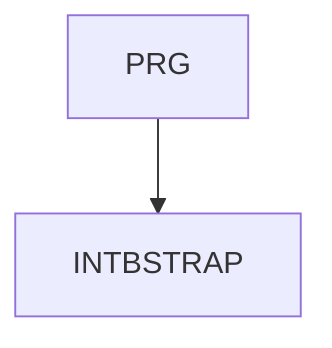

INTBSTRAP - Tvorba webových aplikací pomocí frameworku Bootstrap  
Tvorbu webových stránek a aplikací může výrazně usnadnit framework Bootstrap - předem připravené CSS, JavaScript a bohatá nabídka znovupoužitelných HTML komponent (layout, navigace, formuláře a mnoho dalších). Framework se jednoduše instaluje, je kompletně responsivní, mobile-friendly a přístupný i hendikepovaným uživatelům. Na kurzu se seznámíte s použitými koncepty CSS a HTML a naučíte se Bootstrap přizpůsobit potřebám vašeho projektu.     

Délka: 2 dny

#### Graf návazností

#### Co Vás naučíme
* Vztah HTML, CSS a JavaScriptu
* Proč používat Bootstrap, podpora v prohlížečích
* Instalace frameworku v různých prostředích
* Podstatné koncepty HTML5 (sémantické značky, uživatelské atributy, přístupnost)
* Použité koncepty CSS3 (media queries, responsivní grafika, FlexBox, CSS proměnné) 
* Reboot CSS (srovnání rozdílu mezi prohlížeči)
* Layout stránky, grid system, breakpoints
* Kaskádové styly v Bootstrap (typografie, images, helpers, utilities)
* Formuláře
* Ostatní komponenty (navigace, accordion, buttons, carousel aj.)
* Přizpůsobení Bootstrapu, stručný úvod do SASS

#### Požadované vstupní znalosti
* Základní znalost HTML a CSS na úrovni kurzu INTHTML.

#### Metody výuky
* Odborný výklad s praktickými ukázkami, cvičení na počítačích.

#### Studijní materiály
* Prezentace probírané látky v tištěné nebo online formě

#### Osnova kurzu
Vztah HTML, CSS a JavaScriptu
* aktuální verze
* responsivní web, mobile-first přístup

Použité základní koncepty
* sémantické značky v HTML5
* uživatelské atributy "data-"
* přístupnost pro hendikepované uživatele
* @media query
* FlexBox
* CSS3 proměnné (custom properties)

Jak začíst Bootstrap používat
* hotový CSS a JavaScript (CDN, vlastní server)
* zdrojové soubory (co je to SASS)
* instalace ve vývojových prostředích

Layout stránky
* breakpoints, grid system
* columns
* responsivní utility a komponenty

CSS v Bootstrapu
* reboot
* utilities, helpers
* komponenty

Typografie, responsivní grafika

Formuláře
* nové formulářové prvky v HTML5
* jejich vzhled v Bootstrapu

Komponenty (navigace, cards, alerts, accordion, carousel aj.)

Kdy je potřeba JavaScipt (dropdown, collapse, popover, aj.)

Přizpůsobení Bootstrapu, stručný úvod do SASS