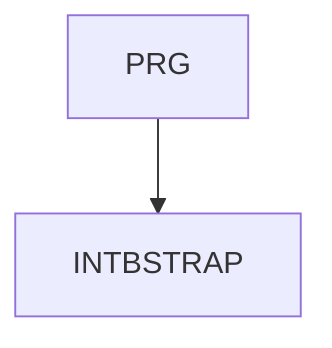

# INTBSTRAP - Creating web applications using the Bootstrap framework  

The Bootstrap framework can greatly facilitate the creation of websites and applications - pre-prepared CSS, JavaScript and a rich offer of reusable HTML components (layout, navigation, forms and many more). The framework is easy to install, fully responsive, mobile-friendly and accessible even for disabled users. The course will introduce you to the CSS and HTML concepts used and teach you how to adapt Bootstrap to the needs of your project.     

Duration: 2 days

#### Connection Chart

#### What we will teach you
* The relationship between HTML, CSS and JavaScript
* Why use Bootstrap, browser support
* Installing the framework in different environments
* Essential HTML5 concepts (semantic tags, user attributes, accessibility)
* CSS3 concepts used (media queries, responsive graphics, FlexBox, CSS variables) 
* Reboot CSS (comparison of differences between browsers)
* Page layout, grid system, breakpoints
* Cascading styles in Bootstrap (typography, images, helpers, utilities)
* Forms
* Other components (navigation, accordion, buttons, carousel, etc.)
* Customizing Bootstrap, brief introduction to SASS

#### Required input knowledge
* Basic knowledge of HTML and CSS at the level of the INTHTML course.

#### Teaching methods
* Expert commentary with practical demonstrations, computer exercises.

#### Study materials
* Presentation of the material covered in printed or online form

#### Course outline
Relationship between HTML, CSS and JavaScript
* current version
* responsive web, mobile-first approach

Basic concepts used
* semantic tags in HTML5
* user attributes "data-"
* accessibility for disabled users
* @media query
* FlexBox
* CSS3 variables (custom properties)

How to start using Bootstrap
* ready-made CSS and JavaScript (CDN, custom server)
* source files (what is SASS)
* installation in development environments

Page layout
* breakpoints, grid system
* columns
* responsive utilities and components

CSS in Bootstrap
* reboot
* utilities, helpers
* components

Typography, responsive graphics

Forms
* new form elements in HTML5
* their appearance in Bootstrap

Components (navigation, cards, alerts, accordion, carousel, etc.)

When JavaScipt is needed (dropdown, collapse, popover, etc.)

Customizing Bootstrap, brief introduction to SASS