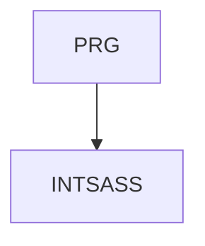

# INTSASS - SASS - prokročilá práce s kaskádovými styly  

Preprocesory, jakýsi mix programování a kaskádovách stylů umožňují vytvářet CSS pro webové aplikace mnohem efektivněji než ruční psaní kaskádových stylů. SASS je dnes nejrozšíženějším preprocesorem v němž jsou psány například zdrojové kódy Bootstrapu.     

Délka: 2 dny

#### Graf návazností

#### Co Vás naučíme
* Prvky programování v CSS3 (custom properties, calc)
* CSS preprocesory - SASS
* Instalace SASS v různých prostředích, Live SASS Compiler (Visual Studio Code)
* Základní syntaxe, struktura projektu
* Proměnné, příkazy, operátory, speciální funkce,
* Selektory, interpolace
* At-rules (@import, @use, @mixin, @function, @if aj.)
* Values (datové typy)
* Vestavěné (built-in) moduly

#### Požadované vstupní znalosti
* Pokročilá znalost HTML a CSS na úrovni kurzu HTMLCSS.

#### Metody výuky
* Odborný výklad s praktickými ukázkami, cvičení na počítačích.

#### Studijní materiály
* Prezentace probírané látky v tištěné nebo online formě

#### Osnova kurzu
Prvky programování v CSS3
* variables (custom-properties)
* calc

CSS preprocesory
* SASS, historie, verze, základní koncept

Jak začíst SASS používat
* Live SASS Compiler (Visual Studio Code)
* instalace ve vývojových prostředích

Základní syntaxe, struktura projektu
* příkazy, výrazy
* operátory, komentáře
* speciální funkce

CSS pravidla
* deklarace vlastností
* selektory
* parent selektor, placeholder selektor

Proměnné

Interpolace

At-rules (@import, @use, @mixin, @function, @if aj.)

Values (datové typy)

Vestavěné (built-in) moduly