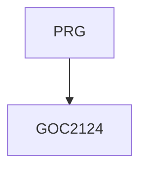

# NTSASS - SASS - advanced work with cascading styles  

Preprocessors, a kind of mix of programming and cascading styles, allow you to create CSS for web applications much more efficiently than writing cascading styles manually. SASS is the most widely used preprocessor today, for example, for writing Bootstrap source code.     

Duration: 2 days

#### Continuity Graph

#### What we will teach you
* Elements of CSS3 programming (custom properties, calc)
* CSS preprocessors - SASS
* Installing SASS in different environments, Live SASS Compiler (Visual Studio Code)
* Basic syntax, project structure
* Variables, commands, operators, special functions,
* Selectors, interpolation
* At-rules (@import, @use, @mixin, @function, @if, etc.)
* Values (data types)
* Built-in modules

#### Required input knowledge
* Advanced knowledge of HTML and CSS at the level of the HTMLCSS course.

#### Teaching Methods
* Expert lecture with practical demonstrations, computer exercises.

#### Study materials
* Presentation of the material covered in printed or online form

#### Course outline
Elements of CSS3 programming
* variables (custom-properties)
* calc

CSS preprocessors
* SASS, history, versions, basic concept

How to start using SASS
* Live SASS Compiler (Visual Studio Code)
* installation in development environments

Basic syntax, project structure
* commands, expressions
* operators, comments
* special functions

CSS rules
* property declarations
* selectors
* parent selector, placeholder selector

Variables

Interpolation

At-rules (@import, @use, @mixin, @function, @if, etc.)

Values (data types)

Built-in modules