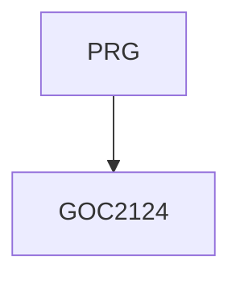

# JS_AJAX - Komunikace se serverem pomocí AJAX a Fetch API  
AJAX (a jeho nástupce Fetch API) umožňují webové aplikaci posílat data na server a stahovat je ze serveru pomocí HTTP protokolu bez obnovení stránky. Kurz je určen pro programátory JavaScriptu, kteří chtějí pochopit nejen principy HTTP ale i zpracování asynchronních požadavků moderním způsobem v nejrůznějších scénářích.   

Délka: 2 dny

#### Graf návazností

#### Co Vás naučíme
* HTTP protokol, komunikace klient-server
* Od stavového kódu 204 k Fetch API
* Asynchronní požadavky a jejich zpracování
* Metody protokolu HTTP (GET, POST a ostatní)
* Objekt XMLHttpRequest
* Strukturovaná data (JSON, XML)
* Zrušení požadavku, timeout
* Kešování, přesměrování
* Monitorování uploadu a stahování dat
* Vícenásobné požadavky a jejich zpracování
* Cookies a přihlášení uživatele, bezpečnost
* Fetch API, Promises, await, async
* Požadavky napříč doménami (CORS)
* Práce se soubory
* Session-history management (řešení tlačítka Zpět)

#### Požadované vstupní znalosti
* Základní znalost JavaScriptu na úrovni kurzu INTJS.

#### Metody výuky
* Odborný výklad s praktickými ukázkami, cvičení na počítačích.

#### Studijní materiály
* Prezentace probírané látky v tištěné nebo online formě

#### Osnova kurzu
HTTP protokol
* požadavek klienta (request), odpověď serveru (response)
* stavové kódy (200, 301, 404 aj.)
* metody GET, POST aj.
* HTTP hlavičky které musíte znát 
* vývojářské nástroje

Komunikace klient-server bez obnovení stránky
* stavový kód 204
* dynamicky vytvářený <script src="">
* XMLHttpRequest (XHR, AJAX)
* Fetch API
* stručně o dalších technologiích (WebSockets, Server-Sent Events, WebRTC)

Zpracování asynchronních požadavků
* události (events): od readystatechange po load
* chybové stavy
* Promises
* await, async

Strukturovaná data
* atribut enctype, hlavička Content-Type
* XML
* JSON

Časový průběh požadavků
* timeout
* abort
* vícenásobné požadavky

Kešování, přesměrování

Skutečný průběh stahování nebo uploadu

Přihlašování uživatele, cookies

Požadavky napříč doménami (CORS)

Práce se soubory
* soubory zpřístupněné uživatelem (input, drag&drop)
* upload souborů (FormData)
* stahování souborů (práce s binárními daty)

Session-history management (řešení tlačítka Zpět)

Fetch API - moderní nástupce AJAXu