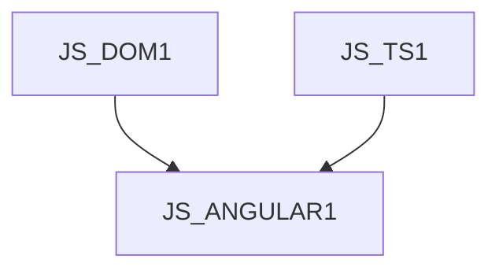

# JS_ANGULAR1 - Angular I: Základy

Kurz je určen pro programátory, kteří znají základy jazyka TypeScript a chtějí se naučit využívat služeb knihovny Angular ve svých front-end webových aplikacích. Naučíte se, mimo jiné, využívat data binding, html šablony, validovat vstupní data nebo komunikovat s back-end API, ale také navrhovat architekturu pro rozsáhlé Angular aplikace složené z mnoha komponent a služeb. Kurz předpokládá znalost objektového modelu DOM v prohlížeči na úrovni kurzu [JS_DOM1] a znalost jazyka TypeScript na úrovni kurzu [JS_TS1].

#### Délka

5 dny

#### Graf návazností

#### Pro koho je kurz určen

- Kurz je určen pro studenty, kteří se chtějí naučit základy vývoje front-end web aplikací pomocí frameworku Angular.

#### Co Vás naučíme

- Architekturu a názvosloví knihovny Angular
- Vytvářet front-end aplikace pro sběr, validaci a presentaci dat
- Spravovat uživatelské události pomocí knihovny Angular
- Vytvářet vlastní Angular komponenty a sdílet mezi nimi stav
- Používat template a reactive forms
- Komunikovat s back-end API pomocí knihovny Angular
- Využívat lazy loading komponent a pokročilý routing

#### Požadované vstupní znalosti

- Syntaxe jazyka TypeScript na úrovni kurzu [JS_TS]
- Znalost DOM objektů na úrovní kurzu [JS_DOM1]

#### Metody výuky

- Odborný výklad s praktickými ukázkami, cvičení na počítačích.

#### Studijní materiály

- Prezentace probírané látky v tištěné nebo online formě

#### Osnova kurzu

Úvod do Angular

- Co je Angular
- Proč TypeScript

Vývojové prostředí

- Hello World
- Struktura projektu

Architektura knihovny

- Moduly, komponenty, šablony (templates)
- Moduly vs stand-alone komponenty
- Dekorátory a metadata
- Direktivy
- Služby a dependency injection

Prezentace dat

- Data binding a výrazy
- Direktivy a bloky pro řízení toku v šablonách
  - podmíněné renedrování
  - opakované renderování
- CSS, style, class

Interakce s uživatelem

- Události a event handlery
- objekt $event

Práce s formuláři

- Referenční proměnné v šablonách
- Template forms
- Reactive forms

Direktivy

- Tvorba atributových direktiv

Spolupráce komponent

- Inputy a outputy
- Služby a dependency injection
- Signály

Komunikace s backendem

- Angular HTTP client
- Observable a rxjs

Navigace (routing)

- Základní navigace
- Vnořené routy
- Parametrické routy
- Lazy loading