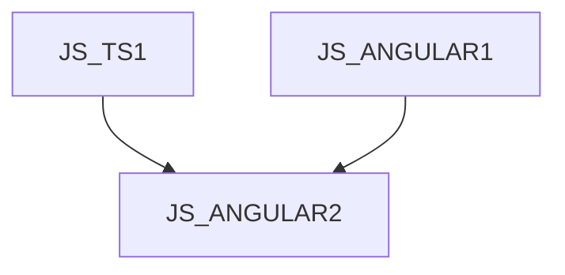

GOC2124 - Jazyk C# - programování I

Kurz je určen pro programátory v jazyce TypeScript, kteří si chtějí prohloubit znalosti vývoje front-end aplikací pomocí knihovny Angular. Účastníci se seznámí s pokročilými technikami prezentace dat a tvorby formulářu, jakožto i pokročilé techniky komunikace mezi komponentami a dependency injection. Kurz předpokládá znalost jazyka TypeScript na úrovni kurzu [JS_TS1] a znalost knihovny Angular na úrovni kurzu [JS_ANGULAR1].

#### Délka

4 dny

#### Graf návazností

#### Pro koho je kurz určen

#### Co Vás naučíme

- Přehled platformy Microsoft .NET
- Proměnné a hodnotové datové typy
- Použití bloků programu, podmíneky a cyklů
- Zpracování výjimek
- Základy objektově orientovaného programování
- Práce s referenčními typy
- Kontruktory, finalizéry a uvolňování zdrojů
- Dědičnost, virtuální metody, abstraktní třídy a Interface
- Registrovat se k událostem
- Používat vlastnosti a indexery

#### Požadované vstupní znalosti

- Základní znalost algoritmizace a programování na úrovni kurzu PRG, případně zkušenosti s programováním v jiném jazyce.
- Kurz není vhodný pro úplné začátečníky, kteří neprogramovali nikdy v žádném programovacím jazyce

#### Metody výuky

- Odborný výklad s praktickými ukázkami, cvičení na počítačích.

#### Studijní materiály

- Prezentace probírané látky v tištěné nebo online formě

#### Osnova kurzu

Pokročilá prezentace dat

- ng-template
- ng-container
- vlastní strukturální direktivy
- async pipe
- @defer bloky

Pokročilé formuláře

- validační direktivy pro template forms
- asynchronní validace
- dynamické změny chování reaktivních formulářů

Životní cykly komponent a direktiv podrobně

- ngDoCheck
- ngAfterContentInit
- ngAfterContentChecked
- ngAfterViewInit
- ngAfterViewChecked
- afterNextRender
- afterRender

Hosting elementy

- Co je host element
- @HostBinding
- @HostListener
- kolize

Dotazy na podřízené komponenty

- Dotazy na obsah
- Lokátory
- Statické dotazy

Pokročilé direktivy

- Strukturální direktivy
- Host Directive
- Kompozice direktiv

Dependency injection

- Injection tokeny podrobně
- Hiararchie injectorů

Optimalizace

- Signály
- Inputy jako signály
- modely
- dotazy
