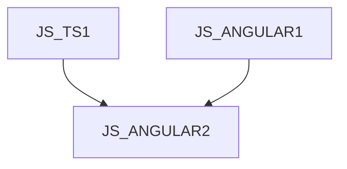

# JS_ANGULAR2 - Angular II: Advanced techniques

This course is designed for TypeScript programmers who want to deepen their knowledge of front-end application development using the Angular library. Participants will learn advanced data presentation and form creation techniques, as well as advanced component communication and dependency injection techniques. The course assumes knowledge of TypeScript at the course level [JS_TS1] and knowledge of the Angular library at the course level [JS_ANGULAR1].

#### Length

5 days

#### Connection Chart

#### For whom the course is intended

- This course is designed for Angular application developers who want to deepen their knowledge of the platform to optimize performance and improve the architecture of their applications.

#### What we will teach you

- Advanced data presentation techniques
- Advanced techniques for forms
- A detailed overview of the component and directive lifecycle
- Advanced component collaboration techniques
- Detailed operation of dependency injection

#### Required Entry Level Knowledge

- Basic knowledge of algorithmization and programming at the level of the PRG course, or experience programming in another language.
- The course is not suitable for complete beginners who have never programmed in any programming language

#### Teaching methods

- Expert lecture with practical demonstrations, exercises on computers.

#### Study materials

- Presentation of the material covered in printed or online form

#### Course outline

Advanced data presentation

- ng-template
- ng-container
- custom structural directives
- async pipe
- @defer blocks

Advanced forms

- validation directives for template forms
- asynchronous validation
- dynamic behavior changes for reactive forms

Component and directive lifecycles in detail

- ngDoCheck
- ngAfterContentInit
- ngAfterContentChecked
- ngAfterViewInit
- ngAfterViewChecked
- afterNextRender
- afterRender

Hosting elements

- What is a guest element
- @HostBinding
- @HostListener
- collision

Queries on child components

- Content queries
- Locators
- Static Queries

Advanced directives

- Structural directives
- Host Directive
- Directive Composition

Dependency injection

- Injection tokens in detail
- Hierarchy of injectors

Optimization

- Signals
- Inputs as signals
- models
- queries
