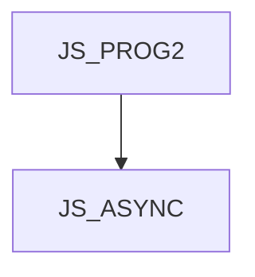

JS_ASYNC - Asynchronní a reaktivní programování v JavaScriptu

Kurz je určen pro JavaScript programátory, kteří si chtějí zdokonalit psaní asynchronního kódu v tomto jazyce. Ukážeme vám jak používat vestavěné asynchronní mechanismy, jako jsou timery, funkce fetch, nebo asynchronní přístup na filesystém z Node.js. Vysvětlíme si objekt Promise a klíčová slova async a await, ale také externí knihovnu rxjs a její Observables. Kurz předpokládá mírně pokročilé znalosti JavaScriptu na úrovni kurzu [JS_PROG2].

#### Délka

3 dny

#### Graf návazností

#### Pro koho je kurz určen

Kurz je určen pro JavaScript programátory, kteří si chtějí zdokonalit psaní asynchronního kódu v tomto jazyce.

#### Co Vás naučíme

- Rozdíl mezi asynchronním a paralelním programováním
- Jak funguje JS event loop
- Vestavěné asynchroní funkce
- Význam callbacku v asynchronním programování
- Promise a async / await pattern
- Reaktivní JS a Observables

#### Požadované vstupní znalosti

- Znalost jazyka JavaScript na úrovní kurzu [JS_PROG2]

#### Metody výuky

- Odborný výklad s praktickými ukázkami, cvičení na počítačích.

#### Studijní materiály

- Prezentace probírané látky v tištěné nebo online formě

#### Osnova kurzu

Úvod do asynchronního programování
- Timery (setTimeout, setInterval)
- Promise a async / await (základní použití)
- Observable (základní použití)
- Asynchronní vs. paralelní

JS event loop

Callback

Promise
- Vytvoření promise
- Jak kombinovat Promises

rxjs a Observable
- vytvoření Observable
- rxjs operátory  
- synchronizace vícero Observables

Asynchronní denerátory
- co je generátor
- jak napsat asynchronní generátor
