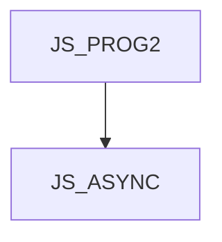

# JS_ASYNC - Asynchronous and reactive programming in JavaScript

This course is designed for JavaScript programmers who want to improve their ability to write asynchronous code in this language. We will show you how to use built-in asynchronous mechanisms such as timers, fetch functions, or asynchronous filesystem access from Node.js. We'll explain the Promise object and the async and await keywords, as well as the external rxjs library and its Observables. This course assumes moderately advanced knowledge of JavaScript at the [JS_PROG2] course level.

#### Length

3 days

#### Connection Graph

#### For whom the course is intended

This course is designed for JavaScript programmers who want to improve their skills in writing asynchronous code in this language.

#### What we will teach you

- The difference between asynchronous and parallel programming
- How the JS event loop works
- Built-in asynchronous functions
- The importance of callbacks in asynchronous programming
- Promise and async / await pattern
- Reactive JS and Observables

#### Required Entry Knowledge

- Knowledge of JavaScript at the course level [JS_PROG2].

#### Teaching Methods

- Expert lecture with practical demonstrations, computer exercises.

#### Study materials

- Presentation of the material covered in printed or online form

#### Course outline

Introduction to asynchronous programming
- Timers (setTimeout, setInterval)
- Promise and async / await (basic usage)
- Observable (basic usage)
- Asynchronous vs. parallel

JS event loop

Callback

Promise
- Creating a promise
- How to combine Promises

rxjs and Observable
- Creating an Observable
- rxjs operators  
- synchronizing multiple Observables

Asynchronous denerators
- what is a generator
- how to write an asynchronous generator