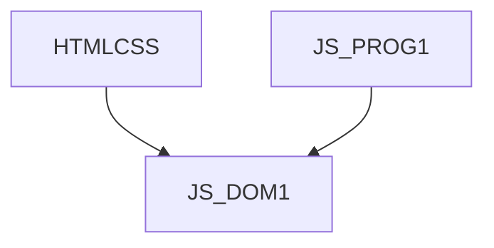

# JS_DOM1 - DOM v JavaScriptu I: Základy

Kurz se věnuje využití jazyka JavaScript v kontextu dynamické HTML stránky. Potřebujete jednoduchou logiku pod tlačítko, chytrou navigaci na stránkách, nebo jen odeslat formulář na server? Nebo vstupujete do světa front-end web developmentu a hledáte první krok směrem k vývoji aplikací v Reactu, Angularu či Vue? Tohle je kurz pro vás.

#### Délka

3 dny

#### Graf návazností

#### Pro koho je kurz určen

Kurz je určen pro začínající JS programátory, kteří už jsou seznámení se základní JS syntaxí, a chtěli by použít JS na tvorbu interaktivních HTML stránek. Student pak může vytvářet vlastní dynamické stránky pomocí JS a DOM, které reagují na uživatelské události a sbírají a validují data pomocí formulářů. Student pak může pokračovat ve vzdělávání v konkrétní front-end knihovně (React, Angular, Vue…).

#### Co Vás naučíme

- Dynamicky ovládat prvky na HTML stránce pomocí JavaScriptu
- Reagovat na uživatelské události
- Používat objekty poskytované prohlížečem, jako jsou Document nebo Window
- Používat a validovat formuláře pomocí programové logiky
- Používat uložiště poskytovaná prohlížečem, jako je cookies nebo LocalStorage
- Dynamicky generovat obsah dokumentu

#### Požadované vstupní znalosti

- Základní znalost jazyka HTML na úrovni kurzu [HTMLCSS].
- Znalost syntaxe jazyka JavaScript na úrovni kurzu [JS_PROG1].

#### Metody výuky

- Odborný výklad s praktickými ukázkami, cvičení na počítačích.

#### Studijní materiály

- Prezentace probírané látky v tištěné nebo online formě

#### Osnova kurzu

Úvod

- Skriptování na webovských stránkách
- Vlastnosti jazyka JavaScript (připomenutí)
- Začlenění JavaScriptu do HTML

Úvod do Document Object Model (DOM)

- Použití objektů
- Node, Element, Attribute a jejich vlastnosti a metody
- Vyhledání elementu v DOM

Použití událostí

- Inline registrace
- DOM Property Event Handlers
- Standardní přístup pomocí addEventListener
- Stornování defaultní akce události
- Probublávání události

Document Object Model (DOM)

- Objekt Window
- Objekt Document
- Objekt Image
- Objekt Navigator

Vytváření interaktivních formulářů

- Formulářové prvky
- Odeslání dat formuláře
- Přístup k formulářovým prvkům
- Validace dat formuláře

Moduly

- Druhy modulů
- Lazy loading

Základy Cookies a Web Storage

- Cookies
  - Vytváření a čtení cookies
  - Možnosti a omezení cookies
  - Bezpečnostní aspekty a omezení platnosti
- Local Storage
  - Ukládání dat
  - Načítání dat
  - Odstraňování dat
  - Omezení a bezpečnostní aspekty
- Session Storage
  - Rozdíly mezi Local Storage a Session Storage
  - Příklady použití