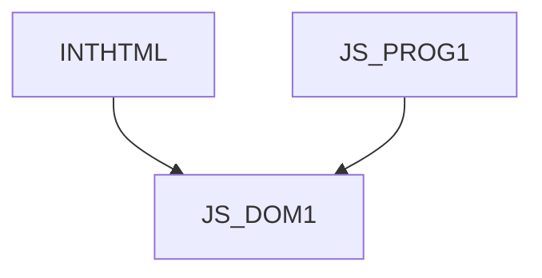

# JS_DOM1 - DOM in JavaScript I: Basics

This course focuses on the use of JavaScript in the context of a dynamic HTML page. Do you need simple logic under a button, smart navigation on a page, or just to submit a form to a server? Or are you entering the world of front-end web development and looking for a first step towards developing applications in React, Angular or Vue? This is the course for you.

#### Length

3 days

#### Connection Chart

#### For whom the course is intended

This course is designed for novice JS programmers who are already familiar with basic JS syntax, and would like to use JS to create interactive HTML pages. The student can then create their own dynamic pages using JS and DOM that respond to user events and collect and validate data using forms. The student can then continue their education in a specific front-end library (React, Angular, Vue...).

#### What we will teach you

- Dynamically control elements on an HTML page using JavaScript
- Respond to user events
- Use browser-provided objects such as Document or Window
- Use and validate forms using program logic
- Use browser-provided storage such as cookies or LocalStorage
- Dynamically generate document content

#### Required input knowledge

- Basic knowledge of HTML at the [HTMLCSS] course level.
- Course-level knowledge of JavaScript syntax [JS_PROG1].

#### Teaching methods

- Expert lecture with practical demonstrations, exercises on computers.

#### Study materials

- Presentation of the material in printed or online form

#### Course outline

Introduction

- Scripting on web pages
- JavaScript language features (reminder)
- Incorporating JavaScript into HTML

Introduction to the Document Object Model (DOM)

- Using Objects
- Node, Element, Attribute and their properties and methods
- Finding an element in the DOM

Using events

- Inline registration
- DOM Property Event Handlers
- Standard approach using addEventListener
- Cancellation of the default event action
- Event bubbling

Document Object Model (DOM)

- Window object
- Document object
- Image object
- Navigator object

Creating interactive forms

- Form Elements
- Sending form data
- Access to form elements
- Validating form data

Modules

- Types of modules
- Lazy loading

Cookies and Web Storage Basics

- Cookies
  - Creating and reading cookies
  - Options and limitations of cookies
  - Security aspects and limitations
- Local Storage
  - Data storage
  - Data retrieval
  - Deleting data
  - Limitations and security aspects
- Session Storage
  - Differences between Local Storage and Session Storage
  - Application Examples