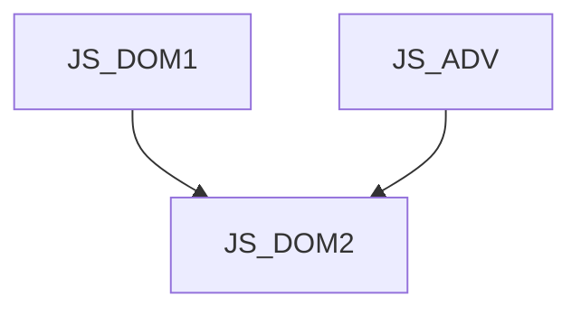

# JS_DOM2 - DOM v JavaScriptu II: Pokročilé techniky
  
Teprve javascriptová API vestavěná v moderních prohlížečích jsou tím, co webovou stránku promění v plnohodnotnou webovou aplikaci ať už se to týká grafiky, interaktivity, práce s daty nebo načítání vstupů z reálného světa. Možnosti jsou omezené jen bezpečností a ochranou soukromí případně výkonem hardware.

Délka: 3 dny

#### Graf návazností

#### Co Vás naučíme
* Práce se soubory zpřístupněnými uživatelem
* Ukládání dat v prohlížeči
* Vylepšená validace formulářů v HTML5
* Vstup z webkamery a mikrofonu
* Javascript a CSS animace
* Práce s grafikou (canvas, video)
* Manipulace s historií prohlížeče pro SPA
* Práce s daty z jiných domén (CORS)
* Spouštění náročnějších výpočtů v samostatných vláknech (Worker)
* Service worker (kešování zdrojů, offline aplikace)
* Základy Fetch API (moderní nástupce AJAXu)
* Upload souborů na server
* Reakce na skrolování stránky, lazy-loading

#### Požadované vstupní znalosti
* Znalost JavaScriptu na úrovni kurzu JS_ADV a DOMu na úrovni kurzu JS_DOM1.

#### Metody výuky
* Odborný výklad s praktickými ukázkami, cvičení na počítačích.

#### Studijní materiály
* Prezentace probírané látky v tištěné nebo online formě

#### Osnova kurzu
Práce se soubory zpřístupněnými uživatelem
* <input type="file">, nativní drag&drop v HTML5
* FileList, File, FileReader a URL API 
* Náhled obrázku před odesláním
* FormData API (odeslání dat na server)

Session History Management ("History API")
* jak zachovat uživatelský komfort při změně obsahu stránky
* ošetření tlačítka Zpět v AJAXových aplikacích
* history.pushState, history.replaceState
* událost popstate na objektu window

Ukládání dat v prohlížeči
* ošetření tlačítka pro obnovení stránky (F5)
* WebStorage (localStorage)
* IndexedDB

Práce s animacemi
* API pro práci s CSS3 animacemi
* requestAnimationFrame

Práce s grafikou 
* <canvas> ve 2d kontextu - programovatelný obrázek

Načtení vstupu z webkamery a mikrofonu
* getUserMedia a navazující API

Vylepšená validace formulářů v HTML5
* nové typy formulářových prvků a atributů
* Constraint and Validation API

Práce s daty z jiných domén (CORS)
* Cross-Origin Resource Sharing
* využití pro AJAX, canvas a externí soubory

Základy Fetch API (moderní nástupce AJAXu)

JavaScript v samostatných vláknech (Worker)

Service worker (kešování zdrojů, offline aplikace)

Reakce na skrolování stránky, lazy-loading
* InterSection Observer