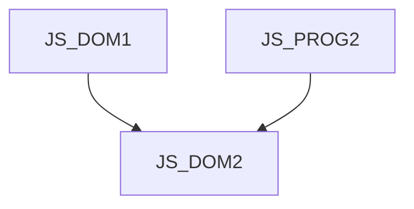

JS_DOM2 - DOM in JavaScript II: Advanced Techniques

Only the javascript APIs built into modern browsers are what turn a web page into a full-fledged web application, whether it's graphics, interactivity, data handling, or reading inputs from the real world. The possibilities are limited only by security and privacy or hardware performance.

Duration: 3 days

#### Connectivity chart

#### What we will teach you
* Working with files accessed by the user
* Storing data in the browser
* Improved form validation in HTML5
* Webcam and microphone input
* Javascript and CSS animations
* Work with graphics (canvas, video)
* Browser history handling for SPA
* Working with data from other domains (CORS)
* Running more complex calculations in separate threads (Worker)
* Service worker (resource caching, offline applications)
* Fetch API basics (modern successor of AJAX)
* Uploading files to the server
* Response to page scrolling, lazy-loading

#### Required entry skills
* Knowledge of JavaScript at the JS_PROG2 course level and DOM at the JS_DOM1 course level.

#### Teaching methods
* Expert lecture with practical demonstrations, computer exercises.

#### Study materials
* Presentation of the material covered in printed or online form

#### Course outline
Working with files accessed by the user
* <input type="file">, native drag&drop in HTML5
* FileList, File, FileReader and URL API 
* Image preview before uploading
* FormData API (send data to server)

Session History Management ("History API")
* how to maintain user experience when changing page content
* Back button treatment in AJAX applications
* history.pushState, history.replaceState
* popstate event on window object

Storing data in the browser
* treatment of page refresh button (F5)
* WebStorage (localStorage)
* IndexedDB

Working with animations
* API for working with CSS3 animations
* requestAnimationFrame

Working with graphics 
* <canvas> in 2d context - programmable image

Loading input from webcam and microphone
* getUserMedia and downstream APIs

Improved form validation in HTML5
* new form element types and attributes
* Constraint and Validation API

Working with data from other domains (CORS)
* Cross-Origin Resource Sharing
* use for AJAX, canvas and external files

Fetch API basics (modern successor to AJAX)

JavaScript in separate threads (Worker)

Service worker (resource caching, offline applications)

Reacting to page scrolling, lazy-loading
* InterSection Observer

