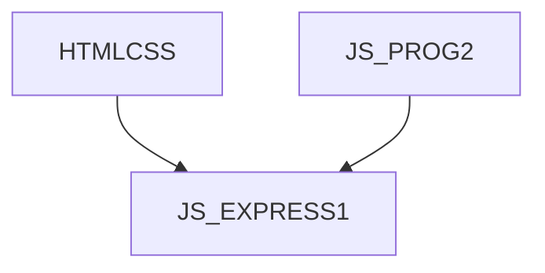

# JS_EXPRESS1 - Tvorba backend aplikací pomocí Express.js

Kurz je určen pro programátory, kteří chtějí použít JavaScript na straně serveru, ať už pro tvorbu interaktivních serverových aplikací, tak pro tvorbu REST API. Účastníci se seznámí se zpracováním requestu pomocí middleware funkcí, tvornou server-side HTML aplikací a tvorbou REST API. Kurz předpokládá znalost HTML na úrovni kurzu [HTMLCSS] a mírně pokročilé programování v jazyce JavaScript na úrovni kurzu [JS_PROG2].

#### Délka

5 dní

#### Graf návazností

#### Pro koho je kurz určen

- Mírně pokročilé JS programátory, kteří chtějí použít JavaScript na straně serveru

#### Co Vás naučíme

- Základní Request/Response model v Expressu
- Routování
- Práce s middlewary
- Template knihovny pro HTML
- Tvorba a konzumace REST API

#### Požadované vstupní znalosti

- Znalost HTML na úrovni kurzu [HTMLCSS]
- Znalost JavaScriptu na úrovní kurzu [JS_PROG2]

#### Metody výuky

- Odborný výklad s praktickými ukázkami, cvičení na počítačích.

#### Studijní materiály

- Prezentace probírané látky v tištěné nebo online formě

#### Osnova kurzu

Úvod

- HTTP
- Node.js a createServer()
- Co je express.js
- Vývojové prostředí
- Hello World
- Express generator

Základní práce s HTTP

- Čtení requestu
- Generování a odesílání responsu
- Obsluha statických souborů

Routing

- Jednoduchý routing
- Vnořené routy
- Patterny
- Objekt Router
- Parametrické routy
  - url query parametry
  - vlastní parametry (např. /todo/:id)

Middleware

- Vestavněné middlewary
- Vlastní middleware
- sdílení dat pomocí request objektu
- logování
- správa chyb
- session
- autentizace / autorizace
- validace

Generování HTML pomocí template

- Nastavení template enginu
- Pug (ex Jade)
- Prezentace dat
- Podmíněné a opakované renderování
- Mixin

Tvorba REST API

- JSON body parser
- CORS
- OpenAPI

Express a Typescript