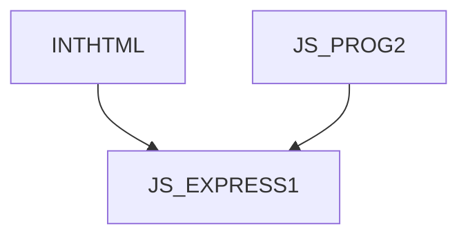

# JS_EXPRESS1 - Creating backend applications using Express.js

This course is designed for programmers who want to use JavaScript server-side, either for creating interactive server-side applications or for creating REST APIs. Participants will learn about request processing using middleware functions, creating server-side HTML applications, and creating REST APIs. The course assumes knowledge of HTML at the [HTMLCSS] course level and moderately advanced JavaScript programming at the [JS_PROG2] course level.

#### Length

5 days

#### Connection Chart

#### For whom the course is intended

- Intermediate JS programmers who want to use server-side JavaScript

#### What we will teach you

- The basic Request/Response model in Express
- Routing
- Working with middlewares
- Template libraries for HTML
- Creating and consuming REST APIs

#### Required Entry Level Knowledge

- Knowledge of HTML at course level [HTMLCSS].
- Course-level knowledge of JavaScript [JS_PROG2]

#### Teaching Methods

- Expert lecture with practical demonstrations, computer exercises.

#### Study materials

- Presentation of the material covered in printed or online form

#### Course outline

Introduction

- HTTP
- Node.js and createServer()
- What is express.js
- Development environment
- Hello World
- Express generator

Basic HTTP work

- Reading a request
- Generating and sending a response
- Handling static files

Routing

- Simple routing
- Nested Routes
- Patterns
- Router object
- Parametric routers
  - url query parameters
  - custom parameters (e.g. /todo/:id)

Middleware

- Built-in middlewares
- Custom middleware
- Data sharing via request object
- logging
- error management
- session
- authentication/authorization
- validation

HTML generation using template

- Setting up the template engine
- Pug (ex Jade)
- Data presentation
- Conditional and repeated rendering
- Mixin

REST API creation

- JSON body parser
- CORS
- OpenAPI

Express and Typescript