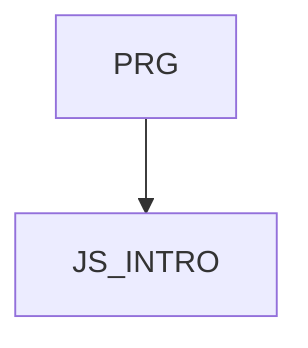

# JS_INTRO - Programování v jazyce JavaScript I

Pokud hledáte cestu jak začít s programováním, nebo pouze potřebujete poskytnout nějakou základní funkčnost vaší HTML stránce, tohle je správný kurz, od kterého začít. Naučíme vás základní koncepty, jako jsou konstanty a proměnné, datové typy hodnot, smyčky a rozhodování v kódu. Příklady budou převeny v prohlížeči, v kontextu HTML stránky, takže výsledky vaší snahy okamžitě uvidíte.

#### Délka

5 dní

#### Graf návazností

#### Co Vás naučíme

* Možná využití jazyka JavaScript
* Základní syntaxi jazyka JavaScript
* Používat vestavěné objekty v JavaScriptu
* Vytvářet jednoduché dynamické HTML stránky

#### Požadované vstupní znalosti

* Základní znalost algoritmizace a programování na úrovni kurzu PRG, případně zkušenosti s programováním v jiném jazyce.
* Kurz není vhodný pro úplné začátečníky, kteří neprogramovali nikdy v žádném programovacím jazyce

#### Metody výuky

* Odborný výklad s praktickými ukázkami, cvičení na počítačích.

#### Studijní materiály

* Prezentace probírané látky v tištěné nebo online formě

#### Osnova kurzu

### Úvod a základní koncepty
- Úvod do JavaScriptu
  - Vlastnosti jazyka JavaScript
  - Historie a vývoj JavaScriptu
  - Transpilace a minifikace
  - Doporučené zdroje
 
### Možná využití v prohlížeči i mimo něj
  - JavaScript v prohlížeči (Front-end)
  - JavaScript mimo prohlížeč (Backend, Node.js)
  - Vývojové prostředí

### Základy jazyka JavaScript
- Hodnoty a datové typy
  - Primitivní datové typy (Number, String, Boolean, null, undefined)
  - Komplexní datové typy (Object, Array)
- Použití proměnných a konstant
  - Deklarace proměnných (var, let, const)
  - Scope a hoisting
- Template literals (volitelně)
  - Interpolace řetězců
  - Víceřádkové řetězce

### Výrazy a operátory
- Aritmetické operátory
- Logické operátory
- Porovnávací operátory
- Podmíněné (ternární) operátory

### Funkce a jejich použití
- Deklarace funkcí
  - Funkční deklarace vs. funkční výrazy
  - Arrow functions
- Použití parametrů a návratových hodnot
  - Parametry funkcí
  - Návratové hodnoty
  - Block a function scope
  - Anonymní a samospouštěcí funkce (IIFE)

### Podmínky a cykly
- Podmíněné konstrukce
  - if
  - switch
- Cykly
  - for, while, do-while
  - Iterační metody pro Arrays (forEach, map, filter)

### Práce s objekty a vestavěné objekty
- JavaScript Object Model
  - Tvorba a manipulace s objekty
- Objekt String
  - Metody pro práci s řetězci
- Objekt Array
  - Metody pro manipulaci s poli
- Objekt Date
  - Metody pro práci s datumem a časem
- Objekt Math
  - Metody pro práci s matematickými funkcemi

### Pokročilé koncepty a praktické příklady (volitelně)
- Anonymní funkce a Arrow functions
- Rest a Spread operátory
- Moduly (Modules)
  - Import a export modulů
  - Strukturování kódu pomocí modulů
- Nástroje pro správu balíčků (npm, Yarn)

### Praktické využití JS
- Demonstrace využití v prohlížeči
  - Manipulace DOM pomocí JavaScriptu
- Demonstrace využití mimo prohlížeč
  - Základy Node.js a jednoduchý server
