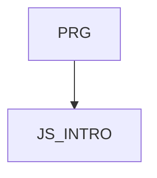

JS_INTRO - JavaScript I: Basics

This course is designed for anyone who wants to learn the basics of JavaScript scripting language, use it on the client or server side of web applications or for testing, or as a stepping stone for TypeScript. Participants will learn about primitive and complex data types, variable declaration, using expressions and operators, creating and using functions, conditions and loops. They will also learn how to work with built-in objects such as String, Array, Date, and Math. The course also covers more advanced concepts such as anonymous functions, Arrow functions, Rest and Spread operators, and modules. The course is not suitable for complete beginners who have never programmed in any programming language; a basic knowledge of algorithmization and programming at the [PRG] course level is recommended, or basic experience programming in another language.

#### Length

5 days

#### Continuity chart

#### For whom the course is intended

- This course is intended for beginning programmers, or programmers in other languages, who want to learn the basic syntax of JavaScript, either as a means of simply scripting HTML pages, or as a foundation for future training in developing entire applications using this language.
- The course is not suitable for complete beginners who have never programmed in any programming language; a basic knowledge of algorithmization and programming at the level of the [PRG] course is recommended, or experience with programming in another language.

#### What we will teach you

- Possible uses of JavaScript
- Basic JavaScript syntax 
- Use built-in objects in JavaScript
- Create simple dynamic HTML pages

#### Prerequisite skills
- Basic knowledge of algorithmization and programming at the level of the PRG course, or experience programming in another language.
- The course is not suitable for complete beginners who have never programmed in any programming language

#### Teaching methods
- Expert lecture with practical demonstrations, exercises on computers.

#### Study materials
- Presentation of the material covered in printed or online form

#### Course outline
Introduction and basic concepts
- Introduction to JavaScript
  - JavaScript language features
  - History and evolution of JavaScript
  - Transpilation and Minification
  - Recommended Resources
 
Possible uses in and out of the browser
  - JavaScript in the browser (front-end)
  - JavaScript outside the browser (Backend, Node.js)
  - Development environment
  Basics of JavaScript
- Values and data types
  - Primitive data types (Number, String, Boolean, null, undefined)
  - Complex data types (Object, Array)
- Using variables and constants
  - Variable declarations (var, let, const)
  - Scope and hoisting
- Template literals (optional)
  - String interpolation
  - Multiline strings

Expressions and operators
- Arithmetic operators
- Logical operators
- Comparison operators
- Conditional (ternary) operators

Functions and their uses
- Function declarations
  - Function declarations vs. function expressions
  - Arrow functions
- Using parameters and return values
  - Function parameters
  - Return values
  - Block and function scope
  - Anonymous and self-executing functions (IIFE)

Conditions and cycles
- Conditional constructs
  - if
  - switch
- Cycles
  - for, while, do-while
  - Iteration methods for Arrays (forEach, map, filter)

Working with objects and built-in objects
- JavaScript Object Model
  - Creating and manipulating objects
- String object
  - Methods for working with strings
- Array object
  - Methods for manipulating arrays
- Date object
  - Methods for working with date and time
- Object Math
  - Methods for working with mathematical functions

Advanced concepts and practical examples (optional)
- Anonymous functions and Arrow functions
- Rest and Spread operators
- Modules
  - Importing and exporting modules
  - Structuring code with modules
- Package management tools (npm, Yarn)

Practical use of JS
- Demonstration of use in the browser
  - DOM manipulation using JavaScript
- Demonstration of use outside the browser
  - Node.js basics and a simple server