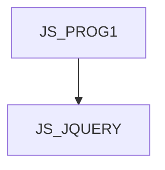

JS_JQUERY - jQuery Framework  
Kurz je určen všem, kteří znají základy programovacího jazyka JavaScript a chtějí se naučit efektivně programovat v JavaScriptu pomocí frameworku jQuery. Na kurzu se naučíte používat funkce jQuery, využívat selektory, atributy, filtrovat, vyhledávat a zřetězovat výsledky, manipulovat s DOMem, CSS a událostmi, vytvářet efekty a využívat jQuery UI.  

#### Délka

3 dní

#### Graf návazností

#### Co Vás naučíme

- Využívat schopností knihovny jQuery
- Používat selektory pro vybírání elementů v html dokumentu
- Používat události
- Pracovat s CSS a atributy
- Manipulovat s DOMem
- Používat základní rozšíření jQuery UI

#### Požadované vstupní znalosti

- Tvorba WWW stránek v HTML/XHTML a CSS
- Základy jazyka JavaScript na úrovni kurzu INTJS

#### Metody výuky

- Odborný výklad s praktickými ukázkami, cvičení na počítačích

#### Studijní materiály

- Prezentace probírané látky v tištěné nebo online formě

#### Osnova kurzu

Základy

- Co je jQuery
- Kompatibilita
- Licence
- Kde hledat informace
- Stažení jQuery
- Jak jQuery funguje
- Datové typy

Základní funkce

- Funkce jQuery
- Přístup k objektu jQuery
- Datový sklad
- Interoperabilita

Selektory

- Základní selektory
- Hierarchické selektory
- Základní filtry
- Obsahové filtry
- Filtry viditelnosti
- Filtry atributů
- Filtry potomků
- Formulářové pseudotřídy
- Formulářové filtry

Události

- Události v jQuery
- Zpracování událostí
- Načtení stránky
- Pomocné metody

Práce s atributy

- Attr a removeAttr
- Class
- Html
- Text
- Value

CSS

- Nastavení CSS
- Pozicování
- Výška a šířka

Traverzování DOMu

- Filtrování
- Vyhledávání
- Zřetězení

Manipulace s DOMem

- Změna obsahu
- Vkládání do elementu
- Vkládání mimo element
- Obalování
- Nahrazování
- Odstraňování
- Kopírování

Efekty

- Základní
- Pohyb
- Průsvitnost
- Ostatní

Pomocné funkce

- Prohlížeč
- Pole a Objekt
- Funkce
- Řetězec

jQuery UI

- Interakce myši
- Rozšíření UI
- Efekty