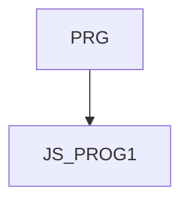

JS_PROG1 - JavaScript I: Základy

Kurz je určen všem, kteří se chtějí naučit základy skriptovacího jazyka JavaScript, využívat ho na klientské nebo serverové straně webových aplikací nebo pro testování, popřípadě jako odrazový můstek pro jazyk TypeScript. Účastníci se seznámí s primitivními a komplexními datovými typy, deklarací proměnných, použitím výrazů a operátorů, tvorbou a používáním funkcí, podmínkami a cykly. Dále se naučí pracovat s vestavěnými objekty jako jsou String, Array, Date a Math. Kurz také zahrnuje pokročilejší koncepty jako jsou anonymní funkce, Arrow functions, Rest a Spread operátory, a moduly. Kurz není vhodný pro úplné začátečníky, kteří neprogramovali nikdy v žádném programovacím jazyce, doporučuje se základní znalost algoritmizace a programování na úrovni kurzu [PRG], případně základní zkušenosti s programováním v jiném jazyce.

#### Délka

5 dní

#### Graf návazností

#### Pro koho je kurz určen

- Kurz je určen pro začínající programátory, případně pro programátory v jiných jazycích, kteří se chtějí naučit základní syntaxi jazyka JavaScript, ať už jako prostředek pro jednoduché skriptování HTML stránek, nebo jako základ pro další budoucí vzdělávání ve vývoji celých aplikací pomocí tohoto jazyka.
- Kurz není vhodný pro úplné začátečníky, kteří neprogramovali nikdy v žádném programovacím jazyce, doporučuje se základní znalost algoritmizace a programování na úrovni kurzu [PRG], případně zkušenosti s programováním v jiném jazyce.

#### Co Vás naučíme

- Možná využití jazyka JavaScript
- Základní syntaxi jazyka JavaScript 
- Používat vestavěné objekty v JavaScriptu
- Vytvářet jednoduché dynamické HTML stránky

#### Požadované vstupní znalosti
- Základní znalost algoritmizace a programování na úrovni kurzu PRG, případně zkušenosti s programováním v jiném jazyce.
- Kurz není vhodný pro úplné začátečníky, kteří neprogramovali nikdy v žádném programovacím jazyce

#### Metody výuky
- Odborný výklad s praktickými ukázkami, cvičení na počítačích.

#### Studijní materiály
- Prezentace probírané látky v tištěné nebo online formě

#### Osnova kurzu
Úvod a základní koncepty
- Úvod do JavaScriptu
  - Vlastnosti jazyka JavaScript
  - Historie a vývoj JavaScriptu
  - Transpilace a minifikace
  - Doporučené zdroje
 
Možná využití v prohlížeči i mimo něj
  - JavaScript v prohlížeči (Front-end)
  - JavaScript mimo prohlížeč (Backend, Node.js)
  - Vývojové prostředí

Základy jazyka JavaScript
- Hodnoty a datové typy
  - Primitivní datové typy (Number, String, Boolean, null, undefined)
  - Komplexní datové typy (Object, Array)
- Použití proměnných a konstant
  - Deklarace proměnných (var, let, const)
  - Scope a hoisting
- Template literals (volitelně)
  - Interpolace řetězců
  - Víceřádkové řetězce

Výrazy a operátory
- Aritmetické operátory
- Logické operátory
- Porovnávací operátory
- Podmíněné (ternární) operátory

Funkce a jejich použití
- Deklarace funkcí
  - Funkční deklarace vs. funkční výrazy
  - Arrow functions
- Použití parametrů a návratových hodnot
  - Parametry funkcí
  - Návratové hodnoty
  - Block a function scope
  - Anonymní a samospouštěcí funkce (IIFE)

Podmínky a cykly
- Podmíněné konstrukce
  - if
  - switch
- Cykly
  - for, while, do-while
  - Iterační metody pro Arrays (forEach, map, filter)

Práce s objekty a vestavěné objekty
- JavaScript Object Model
  - Tvorba a manipulace s objekty
- Objekt String
  - Metody pro práci s řetězci
- Objekt Array
  - Metody pro manipulaci s poli
- Objekt Date
  - Metody pro práci s datumem a časem
- Objekt Math
  - Metody pro práci s matematickými funkcemi

Pokročilé koncepty a praktické příklady (volitelně)
- Anonymní funkce a Arrow functions
- Rest a Spread operátory
- Moduly (Modules)
  - Import a export modulů
  - Strukturování kódu pomocí modulů
- Nástroje pro správu balíčků (npm, Yarn)

Praktické využití JS
- Demonstrace využití v prohlížeči
  - Manipulace DOM pomocí JavaScriptu
- Demonstrace využití mimo prohlížeč
  - Základy Node.js a jednoduchý server