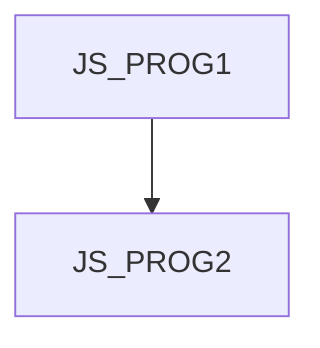

# JS_PROG2 - JavaScript II: Pokročilé techniky

Kurz je určen pro JS programátory, kteří již zvládli syntaxi jazyka a jou připraveni se seznámit se složitějšími konceptry, které přináší funkcionální a opběktově-orientované paradigma.Účastníci se též seznámí se správou chyb, prací s daty ve formátu JSON a se základy asynchroního programování. Cílem je přejít z programování izolovaných algorytmů na vývoj aplikací.
Kurz předpokládá znalost základní syntaxe jazyka JavaScript na úrovni kurzu [JS_PROG1]

#### Délka

5 dní

#### Graf návazností

#### Pro koho je kurz určen

Kurz je určen pro JS programátory, kteří již zvládli syntaxi jazyka a jou připraveni se seznámit se složitějšími konceptry, které přináší funkcionální a opběktově-orientované paradigma.

#### Co Vás naučíme

- základy oběktově orientovaného programování v JS
- základy funkcionálního programování v JS
- správu chyb v JS
- serializaci a deserializaci objektů do formátu JSON
- základy asynchronního programování v JS

#### Požadované vstupní znalosti

- Základní znalost algoritmizace a programování na úrovni kurzu PRG, případně zkušenosti s programováním v jiném jazyce.
- Kurz není vhodný pro úplné začátečníky, kteří neprogramovali nikdy v žádném programovacím jazyce

#### Metody výuky

- Odborný výklad s praktickými ukázkami, cvičení na počítačích.

#### Studijní materiály

- Prezentace probírané látky v tištěné nebo online formě

#### Osnova kurzu

Úvod a základní koncepty

- Stručná rekapitulace základů JS
- Použití var, let, const
- Hodnotové a referenční typy

Funkce

- Funkce jako objekt
- Lokální funkce
- Přetěžování funkcí
- Argumenty funkce
- Self-Invoked funkce
- Closures
- Arrow funkce

Objektové programování

- Object initializer
- Konstrukční funkce
- Class
- Prototype
- Metody, bind(), arrow funkce a this
- Nullish Coalescing Operator
- Optional Chaining

Error handling a debugging

- Try...catch a finally
- Custom Error objekty
- Debugging techniky v moderních prohlížečích a Node.js
- Použití debuggeru

JSON (JavaScript Object Notation)

- Parsování a serializace JSON dat
- Práce s JSON v rámci aplikací

Úvod do asynchronního programování

- Timery (setTimeout, setInterval)
- Promise a async / await (základní použití)
- Handling multiple asynchronous operations (Promise.all, Promise.race)
- Observable (základní použití)
- Event Loop a jeho fungování