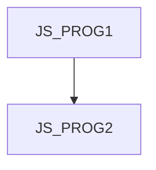

# JS_PROG2 - JavaScript II: Advanced techniques

This course is designed for JS programmers who have already mastered the syntax of the language and are ready to learn the more complex concepts introduced by the functional and object-oriented paradigm.Participants will also learn about error handling, working with JSON data, and the basics of asynchronous programming. The goal is to move from programming isolated algorithms to application development.
The course assumes knowledge of basic JavaScript syntax at the [JS_PROG1] course level.

#### Length

5 days

#### Connection Chart

#### For whom the course is intended

This course is designed for JS programmers who have already mastered the syntax of the language and are ready to learn the more complex concepts introduced by the functional and object-oriented paradigms.

#### What we will teach you

- the basics of object-oriented programming in JS
- basics of functional programming in JS
- error management in JS
- serialization and deserialization of objects into JSON format
- basics of asynchronous programming in JS

#### Required entry knowledge

- Basic knowledge of algorithmization and programming at the level of the PRG course, or experience with programming in another language.
- The course is not suitable for complete beginners who have never programmed in any programming language

#### Teaching methods

- Expert lecture with practical demonstrations, exercises on computers.

#### Study materials

- Presentation of the material covered in printed or online form

#### Course outline

Introduction and basic concepts

- Brief recap of JS basics
- Using var, let, const
- Value and reference types

Functions

- Functions as objects
- Local functions
- Overloading functions
- Function arguments
- Self-Invoked Functions
- Closures
- Arrow functions

Object Oriented Programming

- Object initializer
- Construction functions
- Class
- Prototype
- Methods, bind(), arrow function and this
- Nullish Coalescing Operator
- Optional Chaining

Error handling a debugging

- Try...catch a finally
- Custom Error objects
- Debugging techniques in modern browsers and Node.js
- Using a debugger

JSON (JavaScript Object Notation)

- Parsing and serializing JSON data
- Working with JSON within applications

Introduction to asynchronous programming

- Timers (setTimeout, setInterval)
- Promise and async / await (basic usage)
- Handling multiple asynchronous operations (Promise.all, Promise.race)
- Observable (basic usage)
- Event Loop and how it works