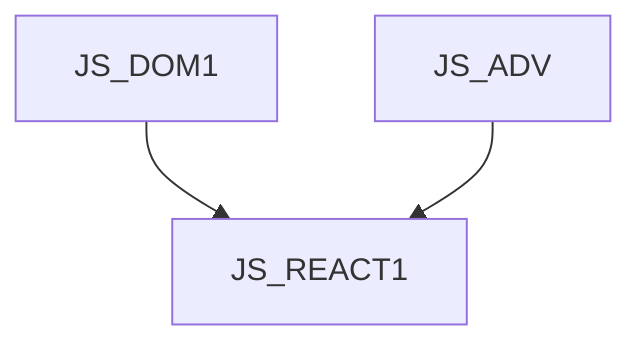

JS_REACT1 - Úvod do React.js

Kurz je určen pro mírně pokročilé programátory v jazyce JavaScript, kteří se chtějí naučit základy vývoje front-end web aplikací pomocí frameworku React. Student se seznámí se základy vývoje React aplikací, jako je prezentace dat, reakce na uživatelské události, tvorbu formulářů a komunikaci s back-endem a navigaci. Také se naučíte základy architektury a designu React aplikací, pomocí konceptů, jako jsou komponenty, vlastnosti, hooky a správa savu. Kurz předpokládá znalost objektového modelu DOM v prohlížeči na úrovni kurzu [JS_DOM1] a mírně pokročilé znalosti JavaScriptu na úrovni kurzu [JS_ADV].

#### Délka

5 dní

#### Graf návazností

#### Pro koho je kurz určen

Kurz je určen pro mírně pokročilé programátory v jazyce JavaScript, kteří se chtějí naučit základy vývoje front-end web aplikací pomocí frameworku React.

#### Co Vás naučíme

- Jak postavit vývojové prostředí pro React
- Prezentovat data na stránce
- Reagovat na uživatelské události
- Zpracovat uživatelské vstupy
- Komunikovat s back-endem
- Implementovat front-end navigaci
- Spravovat stav aplikace

#### Požadované vstupní znalosti

- JS na úrovní [JS_DOM1] a [JS_ADV]

#### Metody výuky

- Odborný výklad s praktickými ukázkami, cvičení na počítačích.

#### Studijní materiály

- Prezentace probírané látky v tištěné nebo online formě

#### Osnova kurzu

Úvod

- Co je React
- Vývojové prostředí
- Hello World a struktura projektu

Prezentace dat

- JSX
- Podmíněné renderování
- Opakované renderování
- CSS, class, style

- Interakce s uživatelem
- Události
- Správa stavu
- Formuláře

Správa stavu aplikace

- stav komponenty
- properties
- context
- externí state managery

Komunikace s backendem

- fetch API
- asynchronní funkce a React

Životní cyklus komponent

- inicalizace a cleanup
- užitečné hooky

Navigace

- React router
- Vnořené routy
- Parametrické routy

Úvod do React Redux

- store
- akce a reducery
- slice a funkcionální modul
- store provider a funkcionální modul
