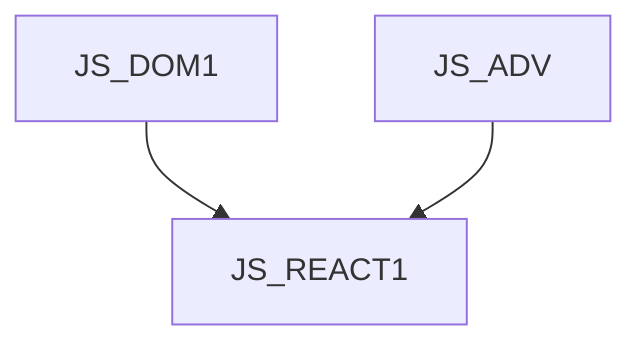

JS_REACT1 - React.js I: Basics

This course is designed for intermediate JavaScript programmers who want to learn the basics of front-end web application development using the React framework. The student will learn the basics of React application development, such as presenting data, responding to user events, creating forms, and communicating with the back-end and navigation. You will also learn the basics of React application architecture and design, using concepts such as components, properties, hooks, and managing your own. The course assumes knowledge of the DOM object model in the browser at the [JS_DOM1] course level and moderately advanced knowledge of JavaScript at the [JS_ADV] course level.

#### Length

5 days

#### Continuity chart

#### For whom the course is intended

This course is designed for intermediate JavaScript programmers who want to learn the basics of front-end web application development using the React framework.

#### What we will teach you

- How to build a development environment for React
- How to present data on a page
- Respond to user events
- Process user input
- Communicate with the back-end
- Implement front-end navigation
- Manage application status
#### Required entry knowledge

- JS at the level of [JS_DOM1] and [JS_ADV]

#### Teaching methods

- Expert lecture with practical demonstrations, computer exercises.

#### Study materials

- Presentation of the material covered in printed or online form

#### Course outline

Introduction

- What is React
- The development environment
- Hello World and project structure

Data presentation

- JSX
- Conditional Rendering
- Repeated rendering
- CSS, class, style

- User interaction
- Events
- State management
- Forms

Manage application state

- Component status
- properties
- context
- external state managers

Communication with the backend

- fetch API
- asynchronous functions and React

Component lifecycle

- Initialization and cleanup
- useful hooks

Navigation

- React router
- Nested routers
- Parametric routs

Introduction to React Redux

- store
- actions and reducers
- slice and functional module
- store provider and functional module