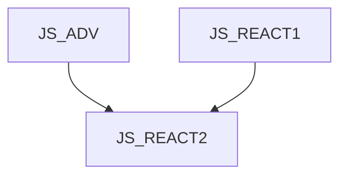

JS_REACT2 - React II: Advanced techniques

This course is designed for advanced JavaScript programmers who want to expand their knowledge of front-end application development in React. The course will give you an overview of hook functions, memoization, reducers and server-side components. The course assumes knowledge of JavaScript at the [JS_ADV] course level and knowledge of the React library at the [JS_REACT1] course level.

#### Length

2 days

#### Connection Chart

#### For whom the course is intended

#### What we will teach you

- Work with built-in React hooks
- Create custom hooks
- Memoization
- Work with server components

#### Required Entry Level Skills

- Course-level knowledge of JavaScript [JS_ADV].
- Course-level knowledge of the React library [JS_REACT1]

#### Teaching Methods

- Expert lecture with practical demonstrations, exercises on computers.

#### Study materials

- Presentation of the material covered in printed or online form

#### Course outline

Use of references

- ElementRef
- useId
- useRef

Memoization

- useMemo
- useCallback
- React compiler

Reducery

- what is a reducer?
- useReducer

Suspence and defer

- Suspense component
- useDefferedValue

Server components