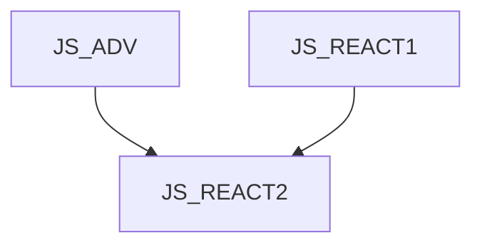

# JS_REACT2 - React - pokročilé techniky

Kurz je určen pro pokročilé programátory v jazyce JavaScript, kteří chtějí rozšířit své znalosti o vývoji front-end aplikací v prostředí React. Na kurzu získáte přehled o hook funkcích, memoizaci, reducerech a serverových komponentách. Kurz předpokládá znalost jazyka JavaScript na úrovni kurzu [JS_ADV] a znalost knihovny React na úrovni kurzu [JS_REACT1].

#### Délka

2 dny

#### Graf návazností

#### Pro koho je kurz určen

#### Co Vás naučíme

- Pracovat s vestavěnými React hooky
- Vytvářet vlastní hooky
- Memoizaci
- Pracovat se serverovými komponentami

#### Požadované vstupní znalosti

- znalost jazyka JavaScript na úrovni kurzu [JS_ADV]
- znalost knihovny React na úrovni kurzu [JS_REACT1]

#### Metody výuky

- Odborný výklad s praktickými ukázkami, cvičení na počítačích.

#### Studijní materiály

- Prezentace probírané látky v tištěné nebo online formě

#### Osnova kurzu

Použití referencí

- ElementRef
- useId
- useRef

Memoizace

- useMemo
- useCallback
- React compiler

Reducery

- co je reducer?
- useReducer

Suspence a defer

- Suspense komponenta
- useDefferedValue

Server components
