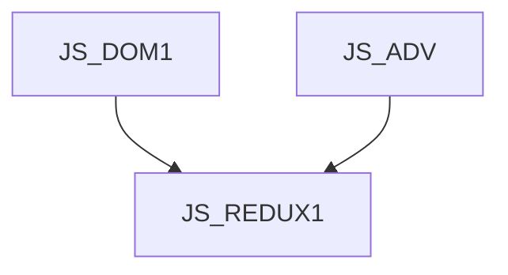

JS_REDUXJS1 - Redux a jeho implementace v Angular a React aplikacích

Kurz je určen pro mírně pokročilé programátory v jazyce JavaScript, kteří se chtějí naučit spravovat stav svých front-end aplikací pomocí knihovny Redux. Účastníci se seznámí s používáním objektů a funckí, které tato knihovna nabízí pro aplikace vyvíjené v Reactu nebo Angularu. Kurz předpokládá znalost objektového modelu DOM v prohlížeči na úrovni kurzu [JS_DOM1] a mírně pokročilé znalosti JavaScriptu na úrovni kurzu [JS_ADV].

#### Délka

2 dny

#### Graf návazností

#### Pro koho je kurz určen

Kurz je určen pro mírně pokročilé programátory v jazyce JavaScript, kteří se chtějí naučit spravovat stav svých front-end aplikací pomocí knihovny Redux.

#### Co Vás naučíme

- vzor Redux
- obecnou práci a koncepty knihovny Redux
- využití v aplikacích (React a Angular)

#### Požadované vstupní znalosti

- znalost objektového modelu DOM v prohlížeči na úrovni kurzu [JS_DOM1]
- mírně pokročilé znalosti JavaScriptu na úrovni kurzu [JS_ADV]

#### Metody výuky

- Odborný výklad s praktickými ukázkami, cvičení na počítačích.

#### Studijní materiály

- Prezentace probírané látky v tištěné nebo online formě

#### Osnova kurzu

Úvod

- návrhový vzor Redux
- framework Redux.js

Základní nastavení a koncepty

- Store
- Slice
- Reducer
- Message
- dispatch
- Selector
- asynchronní reducery

Využití v aplikacích

- React
- Angular
