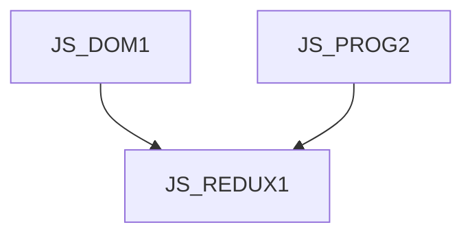

# JS_REDUXJS1 - Redux and its implementation in Angular and React applications

This course is designed for intermediate JavaScript programmers who want to learn how to manage the state of their front-end applications using the Redux library. Participants will learn how to use the objects and features provided by this library for applications developed in React or Angular. The course assumes knowledge of the DOM object model in the browser at the [JS_DOM1] course level and moderately advanced knowledge of JavaScript at the [JS_PROG2] course level.

#### Length

2 days

#### Continuity Graph

#### For whom the course is intended

This course is intended for intermediate JavaScript programmers who want to learn how to manage the state of their front-end applications using the Redux library.

#### What we will teach you

- Redux pattern
- the general workings and concepts of the Redux library
- usage in applications (React and Angular)

#### Required Entry Level Knowledge

- Knowledge of the DOM object model in the browser at the course level [JS_DOM1].
- Moderately advanced knowledge of JavaScript at the course level [JS_PROG2]

#### Teaching methods

- Expert lecture with practical demonstrations, computer exercises.

#### Study materials

- Presentation of the material covered in print or online form

#### Course outline

Introduction

- Redux design pattern
- Redux.js framework

Basic settings and concepts

- Store
- Slice
- Reducer
- Message
- dispatch
- Selector
- asynchronous reducers

Use in applications

- React
- Angular