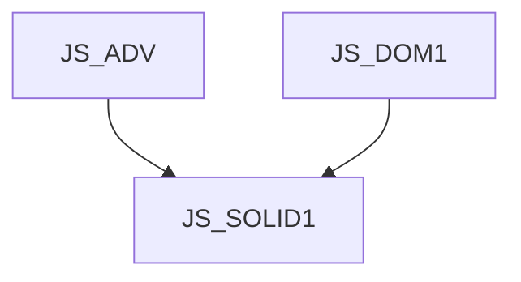

# JS_SOLID1 - Úvod do frameworku Solid.js

Kurz je určen pro mírně pokročilé JS programátory, kteří se chtějí naučit vytvářet front-end aplikace pomocí frameworku SolidJS.

#### Délka

3 dny

#### Graf návazností

#### Pro koho je kurz určen

- Kurz je určen pro mírně pokročilé JS programátory

#### Co Vás naučíme

- Postavit jednoduchou SOLID aplikaci
- Nechat komponenty aplikace spolupracovat a sd9let stav
- Používat signály, efekty a mema
- Interagovat s uživatelem
- Interagovat s backendem.

#### Požadované vstupní znalosti

- JavaScript na úrovni kurzu [JS_ADV]
- Znalost fungování DOM v prohlížeči na úrovni kurzu [JS_DOM1]

#### Metody výuky

- Odborný výklad s praktickými ukázkami, cvičení na počítačích.

#### Studijní materiály

- Prezentace probírané látky v tištěné nebo online formě

#### Osnova kurzu

Úvod

- Co je solid
- Vývojové prostředí
- Hello World
- Struktura projektu

Prezentace dat

- Show
- Switch / Match
- Dynamic
- For
- Index
- Portal
- CSS styly a třídy

Komponenty

- Zanořování komponent
- Životní cykly
- Spolupráce a sdílení stavu

Události, signály a správa stavu

- Interakce s uživatelem
- Signály
- Derivované signály
- Efekty
- Mema
- Store

Komunikace s backendem a asynchronní funkce
