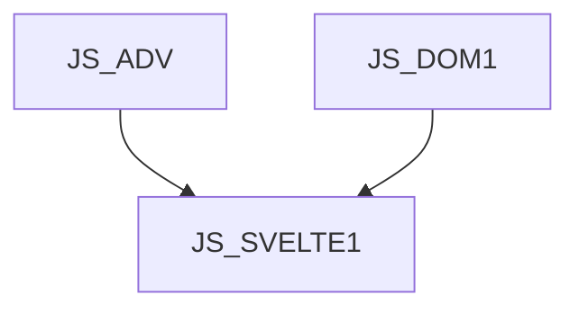

# JS_SVELTE1 - Introduction to the Svelte framework

This course is designed for intermediate JS programmers who want to learn how to create front-end applications using the Svelte framework. Participants will learn the basics of front-end development (data presentation, events, forms, communication with back-end api, navigation) using the SVELTE library. The course assumes knowledge of the DOM object model in the browser at the course level [JS_DOM1] and moderately advanced knowledge of JavaScript at the course level [JS_ADV].

#### Length

3 days

#### Continuity Graph

#### For whom the course is intended

- This course is designed for intermediate JS programmers

#### What we will teach you

- How to build a development environment for Svelte
- How to present data on a page
- Respond to user events
- Process user input
- Communicate with the back-end
- Manage application state

#### Required input knowledge

- JavaScript at course level [JS_ADV]
- Course-level knowledge of how the DOM works in a browser [JS_DOM1]

#### Teaching Methods

- Expert lecture with practical demonstrations, computer exercises.

#### Study materials

- Presentation of the material covered in printed or online form

#### Course outline

Introduction

- What is Svelte
- Development environment
- Hello World
- Project structure

Data presentation

- interpolation
- conditional rendering
- repeated rendering
- CSS styles and classes

Interaction with the user

- event response
- forms and inputs

Components, collaboration and status sharing

- Component targeting
- Life cycles
- Component Property
- Forwarding events
- Reactive values
- Store

Communication with backend and other async processes

Introduction to Svelte kit