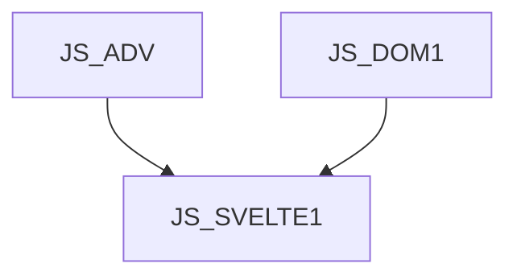

# JS_SVELTE1 - Úvod do frameworku Svelte

Kurz je určen pro mírně pokročilé JS programátory, kteří se chtějí naučit vytvářet front-end aplikace pomocí frameworku Svelte.

#### Délka

3 dny

#### Graf návazností

#### Pro koho je kurz určen

- Kurz je určen pro mírně pokročilé JS programátory

#### Co Vás naučíme

- Jak postavit vývojové prostředí pro Svelte
- Prezentovat data na stránce
- Reagovat na uživatelské události
- Zpracovat uživatelské vstupy
- Komunikovat s back-endem
- Spravovat stav aplikace

#### Požadované vstupní znalosti

- JavaScript na úrovni kurzu [JS_ADV]
- Znalost fungování DOM v prohlížeči na úrovni kurzu [JS_DOM1]

#### Metody výuky

- Odborný výklad s praktickými ukázkami, cvičení na počítačích.

#### Studijní materiály

- Prezentace probírané látky v tištěné nebo online formě

#### Osnova kurzu

Úvod

- Co je Svelte
- Vývojové prostředí
- Hello World
- Struktura projektu

Prezentace dat

- interpolace
- podmíněné renderování
- opakované renderování
- CSS styly a třídy

Interakce s uživatelem

- reakce na události
- formuláře a inputy

Komponenty, spolupráce a sdílení stavu

- Zanořování komponent
- Životní cykly
- Property komponent
- Forwarding eventů
- Reaktivní hodnoty
- Store

Komunikace s backendem a jiné async procesy

Úvod do Svelte kit
