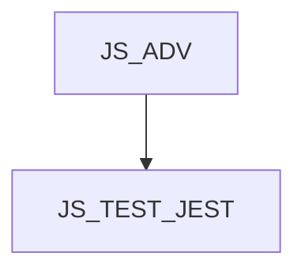

# JS_TEST_JEST - Automatizované testování JS aplikací pomocí knihovny Jest

Kurz je určen pro mírně pokročilé programátory v jazyce JavaScript, kteří se chtějí naučit psát automatizované testy pomocí knihovny Jest. Naučíme vás nejen testy navrhovat a implementovat, ale také o testovací snaze přemýšlet ekonomicky a racionálně. Pro úspěšné absolvování kurzu potřebujete umět jak funkcionální, tak OOP přístup k JavaScriptu a základní znalost práce s promisy ([JS_ADV]).

#### Délka

3 dny

#### Graf návazností

#### Pro koho je kurz určen

Kurz je určen pro mírně pokročilé programátory v jazyce JavaScript, kteří se chtějí naučit psát automatizované testy pomocí knihovny Jest.

#### Co Vás naučíme

- Definovat a kategorizovat testy
- Navrhovat a implementovat automatizované testy
- Testovat funkce a třídy
- Testovat asynchronní kód
- Aplikovat testovací strategie na různé situace

#### Požadované vstupní znalosti

- Programování v jazyce JavaScript na úrovni kurzu [JS_ADV]

#### Metody výuky

- Odborný výklad s praktickými ukázkami, cvičení na počítačích.

#### Studijní materiály

- Prezentace probírané látky v tištěné nebo online formě

#### Osnova kurzu

Úvod
- Testování a automatizace
- Kategorizace testů
- Anatomie testu
- Jest
Základní testy
- Registrace testu
- Aserce (matchers)
- funkce expect()
- pravdivost výrazu
- čísla
- textové řetězce
- pole a objekty
- výjimky
Asynchronní kód
- Promise
- async / await
- callback
- resolves() a rejects() matcher
Inicializace a úklid
- Jednorázově
- Opakovaně
- Pořadí provedení
Mockování
- mockování funkce
- mockování timerů a async funkcí
- mockování modulu
- částečné mockování objektu
- aserce mocků
Snapshoty
