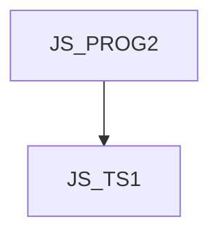

# JS_TS1 - TypeScript - typová kontrola pro JavaScript

Kurz je určen pro mírně pokročilé programátory v jazyce JavaScript, kteří chtějí používat TypeScript pro statickou kontolu typové konsistence. Účastníci se seznámí s jak základní koncepty typových definic, tak i s pokročilímy koncepty jako jsou exhaustvness check klauzule či typová aritmetika. Kurz předpokládá znalost jazyka JavaScript na úrovni kurzu [JS_PROG2].

#### Délka

3 dny

#### Graf návazností

#### Pro koho je kurz určen

Kurz je určen pro vývojáře v Jazyce JavaScript, kteří se chtějí naučit využívat typescript pro statickou typovou kontrolu JavaScript kódu. Předpokládá se, že studenti budou umět JavaScript na úrovni kurzu [JS_PROG2]

#### Co Vás naučíme

- Základní datové typy, včetně any, uknown a never
- Enumerace
- Objektové typy
- Union a intersection typy
- Funkcionální typy
- Třídy a rozhraní

#### Požadované vstupní znalosti

- JavaScript na úrovni kurzu [JS_PROG2]

#### Metody výuky

- Odborný výklad s praktickými ukázkami, cvičení na počítačích.

#### Studijní materiály

- Prezentace probírané látky v tištěné nebo online formě

#### Osnova kurzu

Úvod

- Co je TypeScript
- Vývojové prostředí
- Compiler a jeho konfigurace

Typový systém TypeScriptu

- Typové anotace
- co je strukturální typový systém
- primitivní typy
  - null a undefined
  - any, unknown, never
  - BigInt a Symbol
- typové aliasy
- Objektové typy
  - pole
  - intersekce
- hodnotové (literal) typy
- enumerace

Zužování typů (narrowing)

- přiřazení hodnoty
- typeof jako type guard
- zužování operátorem ===
- operátor in
- operátor instanceof
- typové predikáty
- typové aserce
- typ never a kontrola úplnosti (exhaustiveness check)

Typové anotace funkcí

- parametry a návratové hodnoty, typ void
- generické funkce
- overloading
- Knihovny a typ “unknown”

OOP

- Třídy, vlastnosti a konstruktory
- Rozhraní
- Dědičnost
- Zapouzdření
- Overriding
- Statické metody
- Generické třídy

Typová aritmetika

- Generické typy
- keyof
- typeof v typové definici
- indexer v typové definici
- podmíněné typování
- mapované typy