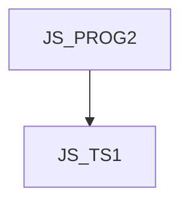

JS_TS1 - TypeScript - type checker for JavaScript

This course is designed for intermediate JavaScript programmers who want to use TypeScript for static type consistency control. Participants will learn both the basic concepts of type definitions as well as advanced concepts such as exhaustvness check clauses and type arithmetic. The course assumes knowledge of JavaScript at the [JS_PROG2] course level.

#### Length

3 days

#### Connection Graph

#### For whom the course is intended

This course is designed for JavaScript developers who want to learn how to use typescript for static type checking of JavaScript code. Students are expected to know JavaScript at the level of the course [JS_PROG2]

#### What we will teach you

- Basic data types, including any, uknown, and never
- Enumeration
- Object types
- Union and intersection types
- Functional types
- Classes and interfaces

#### Required input knowledge

- JavaScript at the course level [JS_PROG2]

#### Teaching Methods

- Expert lecture with practical demonstrations, exercises on computers.

#### Study materials

- Presentation of the material covered in printed or online form

#### Course outline

Introduction

- What is TypeScript
- The development environment
- Compiler and its configuration

TypeScript type system

- Type annotations
- what is the structural type system
- primitive types
  - null and undefined
  - any, unknown, never
  - BigInt and Symbol
- type aliases
- Object types
  - arrays
  - intersection
- value (literal) types
- enumerations

Type narrowing

- value assignment
- typeof as type guard
- operator narrowing ===
- operator in
- operator instanceof
- type predicates
- type assertions
- type never and exhaustiveness check

Function type annotations

- parameters and return values, void type
- generic functions
- overloading
- Libraries and type "unknown"

OOP

- Classes, properties and constructors
- Interfaces
- Inheritance
- Encapsulation
- Overriding
- Static methods
- Generic classes

Type arithmetic

- Generic types
- keyof
- typeof in type definition
- indexer in type definition
- conditional typing
- mapped types
