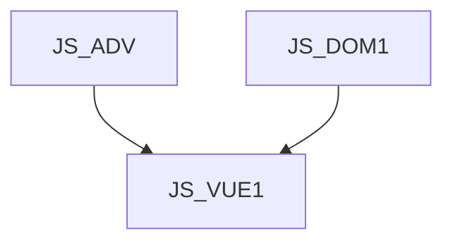

# JS_VUE1 - Úvod do Vue.js

V tomto kurzu se seznámíme s populárním Javascriptovým frameworkem Vue.js. Kurz je zaměřen na pochopení konceptu Vue.js a jeho základní funkcionality, přičemž si v rámci kurzu vytvoříme jednoduchou single page aplikaci. Naučíte se používat routing, seznámíte se s životním cyklem aplikace a state managementem a naučíte se pracovat také s formuláři a dalšími pomocnými knihovnami.

#### Délka

3 dny

#### Graf návazností

#### Co Vás naučíme
* Naučíme Vás vytvářet vlastní jednoduché aplikace ve Vue.js
* Naučíte se používat routing a seznámíte se s životním cyklem aplikace a state managementem
* Naučíte se pracovat s formuláři a dalšími pomocnými knihovnami

#### Pro koho je kurz určen:
* Kurz je určen pro vývojáře, kteří se chtějí naučit pracovat s nejnovějším javascriptovým frameworkem Vue.js

#### Požadované vstupní znalosti
* Kurz předpokládá základní znalosti JavaScriptu verze ES5 a ES6 na úrovni kurzu INTJS a JS_ES6

#### Metody výuky
* Odborný výklad s praktickými ukázkami, cvičení na počítačích.

#### Studijní materiály
* Prezentace probírané látky v tištěné nebo online formě.

#### Osnova kurzu

Úvod
* Co je Vue.Js?
* Historie frameworku
* Srovnání s ostatními frameworky

Teoretická část
* Prezentace data
* Interpolace proměnných a zobrazování dat
* Vestavěné direktivy
* Rendering složitějších datových typů

Práce s daty
* Data binding
* Volání akcí
* Události

Použití lifecycle hooks
* BeforeCreate
* Created
* BeforeMount
* Mounted a další

Routing
* Základy routingu v SPA
* Dynamický routing a historie
* Globální komponenty

Vuex – state management
* Co je to vuex?
* Co je to state management pattern
* State && Getters
* Actions a mutace

Formuláře
* Validace formulářů
* Odeslání formuláře
* Error handling

Pomocné knihovny
* Vue CLI
* Vue Router
* Vue DevTools
* Nuxt.js