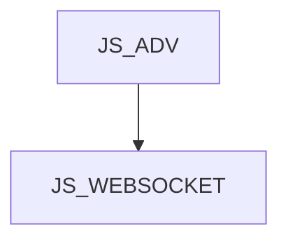

JS_WEBSOCKET - Tvorba JS aplikací s využitím protokolu WebSocket

Kurz je určen pro mírně pokročilé JavaScript programátory, kteří ve svých aplikacích potřebují víc než HTTP Request / Response model. WebSocket protokol umožňuje serveru notifikovat jednoho nebo více klientů, či streamovat data. Účastníci se seznámí s využitím tohoto protokolu ve webových plaikacích. Kurz předpokládá znalost jazyka JavaScript na úrovni kurzu [JS_ADV].

#### Délka

2 dny

#### Graf návazností

#### Pro koho je kurz určen

- Kurz je určen pro JS prográmátory, kteří umí JavaScript na úrovni kurzu [JS_ADV]

#### Co Vás naučíme

- Otevřít a využívat web socket na straně serveru i klienta
- Vytvořit WebSocket klienta v prohlížeči i v prostředí Node.js
- Dělat broadcasty a využívat streamy

#### Požadované vstupní znalosti

- JavaScript na úrovni kurzu [JS_ADV]

#### Metody výuky

- Odborný výklad s praktickými ukázkami, cvičení na počítačích.

#### Studijní materiály

- Prezentace probírané látky v tištěné nebo online formě

#### Osnova kurzu

WS protokol

- WS server
- Node.js, npm a balíček ws
- Třída WebSocketServer
- Reakce na údálosti
  - connect
  - message
  - error

WS klient

- Prohlížeč vs Node.js
- Třída WebSocket
- Autentizace klienta
- Point to point komunikace
- Server broadcast
- Duplex a streaming

Využití / sdílení existujícího HTTP serveru
