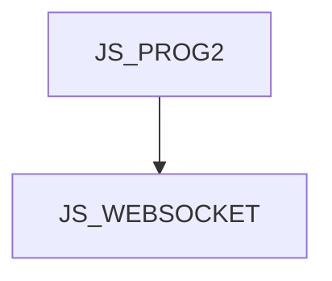

# JS_WEBSOCKET - Creating JS applications using the WebSocket protocol

This course is designed for intermediate JavaScript programmers who need more than the HTTP Request/Response model in their applications. WebSocket protocol allows the server to notify one or more clients or stream data. Attendees will learn about the use of this protocol in web postings. This course assumes knowledge of JavaScript at the [JS_PROG2] course level.

#### Length

2 days

#### Connection Graph

#### For whom the course is intended

- This course is intended for JS programmers who know JavaScript at the [JS_PROG2] course level.

#### What we will teach you

- Open and use a web socket on both the server and client side
- Create a WebSocket client in the browser and in Node.js
- Make broadcasts and use streams

#### Prerequisite skills

- JavaScript at course level [JS_PROG2]

#### Teaching Methods

- Expert lecture with practical demonstrations, computer exercises.

#### Study materials

- Presentation of the material covered in printed or online form

#### Course outline

WS protocol

- WS server
- Node.js, npm and the ws package
- WebSocketServer class
- Event response
  - connect
  - message
  - error

WS client

- Browser vs Node.js
- WebSocket class
- Client authentication
- Point to point communication
- Server broadcast
- Duplex and streaming

Use/share an existing HTTP server