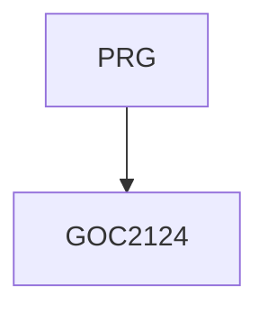

# GOC2124 - Jazyk C# - programování I

Kurz je určen `<komu>`, kteří `<omezení>`. Účastníci se seznámí s `<co vás naučíme>`. Kurz předpokládá znalost `<předpokládané znalosti>`.

Kurz je určen pro všechny programátory, kteří chtějí získat znalosti a dovednosti s vytvářením aplikací v jazyce C# na platformě Microsoft .NET. Na kurzu získáte přehled o platformě Microsoft .NET a jejím vývojovém prostředí Microsoft Visual Studiu .NET. Seznámíte se s jazykem C# s důrazem na základy samotného jazyka a úvod do objektově orientovaného programování. Kurz předpokládá základní znalosti programování v libovolném jazyce. Kurz není vhodný pro úplné začátečníky. začátečníkům doporučujeme navštívit nejprve kurz Úvod do algoritmizace a programování [PRG].

#### Délka

4 dny

#### Graf návazností

#### Pro koho je kurz určen

#### Co Vás naučíme

- Přehled platformy Microsoft .NET
- Proměnné a hodnotové datové typy
- Použití bloků programu, podmíneky a cyklů
- Zpracování výjimek
- Základy objektově orientovaného programování
- Práce s referenčními typy
- Kontruktory, finalizéry a uvolňování zdrojů
- Dědičnost, virtuální metody, abstraktní třídy a Interface
- Registrovat se k událostem
- Používat vlastnosti a indexery

#### Požadované vstupní znalosti

- Základní znalost algoritmizace a programování na úrovni kurzu PRG, případně zkušenosti s programováním v jiném jazyce.
- Kurz není vhodný pro úplné začátečníky, kteří neprogramovali nikdy v žádném programovacím jazyce

#### Metody výuky

- Odborný výklad s praktickými ukázkami, cvičení na počítačích.

#### Studijní materiály

- Prezentace probírané látky v tištěné nebo online formě

#### Osnova kurzu

Přehled platformy Microsoft .NET

- Úvod
- Přehled Microsoft .NET
- Common Langueage Runtime
- Jmenné prostory

Přehled jazyka C#

- Struktura programu v jazyce C#
- Základní I/O operace
- Doporučené praktiky
- Kompilace programu a debugging

Proměnné a datové typy

- Systém obecných typů
- Pojmenovávání proměnných
- Využití základních datových typů
- Uživatelské datové typy
- Konverze datových typů

Bloky programu

- Větvení programu
- Iterace

Metody a parametry

- Použití metod
- Použití parametrů
- Vstupní, výstupní parametry a parametry predávané referencí
- Přetěžování (Overloading)
- Volitelné parametry a pole parametrů

Pole

- Deklarace pole
- Vytvoření jednorozmerného pole
- Vytvoření vícerozmerného pole
- Rozdíl mezi polem a kolekcí
- Základy použití kolekcí ArrayList a List<>

Error Handling a Debugging

- Práce s výjimkami
- Debugging

Základy objektově orientovaného programování

- Objektové třídy a jejich instance
- Privátní a veřejné členy
- Použití this
- Statické členy

Vlastnosti a indexery

- Použití vlastností

Referenční typy

- Využití referencí
- Objektové hierarchie

Vytváření a ničení objektů

- Konstruktory a inicializace objektů
- Destrukce objektů a Garbage Collector

Základy dědičnosti

- Dědičnost a odvozování objektových tříd
- Polymorfismus
- Virtuální metody
- Konverze datových typů, přetypování/casting
- Boxing/UnBoxing
- Imlementace Interface

Delegáti a události

- EventHandler delegát
- Registrace události
