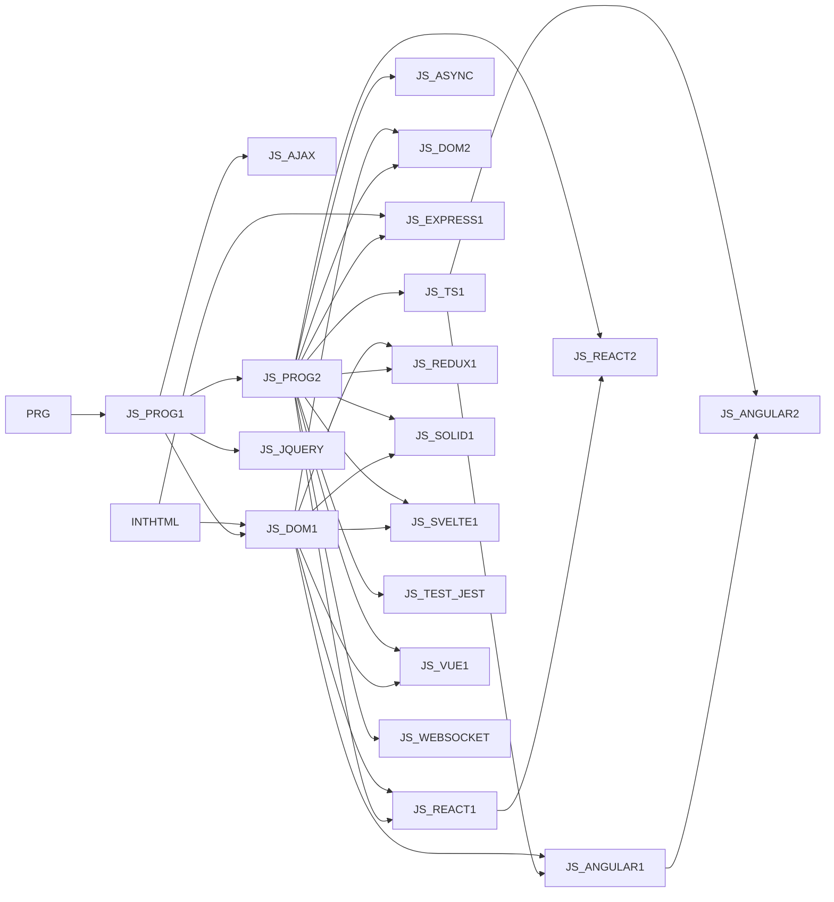

#### Graf návazností

```mermaid
graph LR
    PRG --> JS_PROG1
    JS_PROG1 --> JS_AJAX
    JS_DOM1 --> JS_ANGULAR1
    JS_TS1 --> JS_ANGULAR1
    JS_TS1 --> JS_ANGULAR2
    JS_ANGULAR1 --> JS_ANGULAR2
    JS_PROG2 --> JS_ASYNC
    INTHTML --> JS_DOM1
    JS_PROG1 --> JS_DOM1
    JS_DOM1 --> JS_DOM2
    JS_PROG2 --> JS_DOM2
    INTHTML --> JS_EXPRESS1
    JS_PROG2 --> JS_EXPRESS1
    JS_PROG1 --> JS_JQUERY
    JS_PROG1 --> JS_PROG2
    JS_DOM1 --> JS_REACT1
    JS_PROG2 --> JS_REACT1
    JS_PROG2 --> JS_REACT2
    JS_REACT1 --> JS_REACT2
    JS_DOM1 --> JS_REDUX1
    JS_PROG2 --> JS_REDUX1
    JS_PROG2 --> JS_SOLID1
    JS_DOM1 --> JS_SOLID1
    JS_PROG2 --> JS_SVELTE1
    JS_DOM1 --> JS_SVELTE1
    JS_PROG2 --> JS_TEST_JEST
    JS_PROG2 --> JS_TS1
    JS_PROG2 --> JS_VUE1
    JS_DOM1 --> JS_VUE1
    JS_PROG2 --> JS_WEBSOCKET

```
