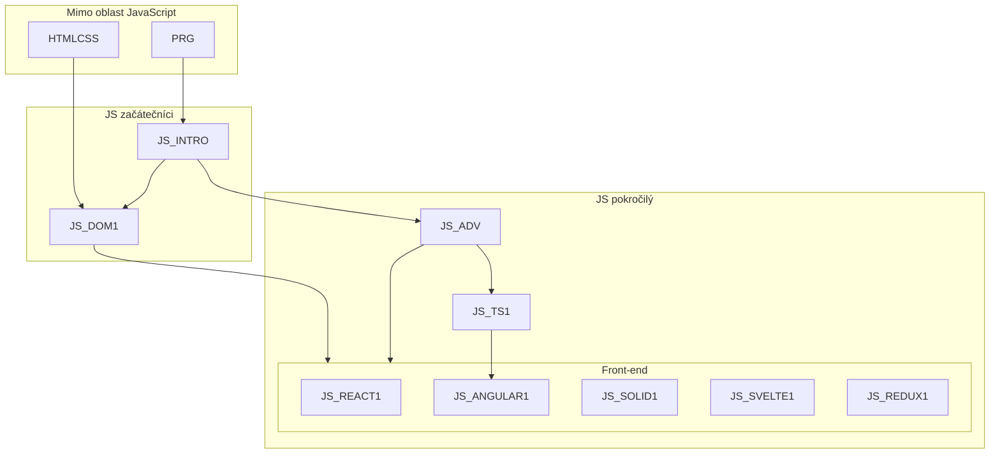

# Mapa oblasti JavaScript

```mermaid
graph TD
    subgraph Mimo oblast JavaScript
        PRG
        HTMLCSS
    end
    subgraph JS začátečníci
        JS_INTRO
        JS_DOM1
    end
    subgraph JS pokročilý
        JS_ADV
        JS_TS1
        subgraph Front-end
            JS_REACT1
            JS_ANGULAR1
            JS_SOLID1
            JS_SVELTE1
            JS_REDUX1            
        end
    end
    PRG --> JS_INTRO
    HTMLCSS --> JS_DOM1
    JS_INTRO --> JS_DOM1
    JS_INTRO --> JS_ADV
    JS_DOM1 --> Front-end
    JS_ADV  --> Front-end
    JS_ADV --> JS_TS1
    JS_TS1 --> JS_ANGULAR1
```
