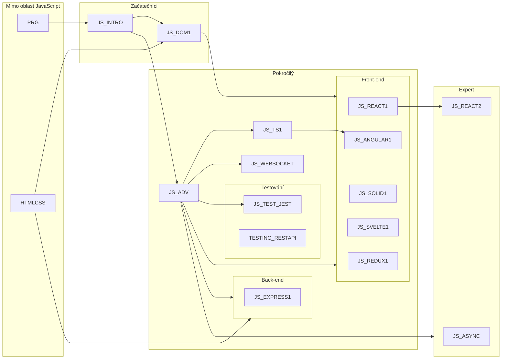

# Mapa oblasti JavaScript

```mermaid
graph LR
    subgraph Mimo oblast JavaScript
        PRG
        HTMLCSS
    end
    subgraph Začátečníci
        JS_INTRO
        JS_DOM1
    end
    subgraph Pokročilý
        JS_ADV
        JS_TS1
        subgraph Front-end
            JS_REACT1
            JS_ANGULAR1
            JS_SOLID1
            JS_SVELTE1
            JS_REDUX1            
        end
        subgraph Back-end
            JS_EXPRESS1
        end
        subgraph Testování
            JS_TEST_JEST
            TESTING_RESTAPI
        end
        JS_WEBSOCKET
    end
    subgraph Expert
        JS_ASYNC
        JS_REACT2
    end

    PRG --> JS_INTRO
    HTMLCSS --> JS_DOM1
    
    JS_DOM1 --> Front-end
    JS_ADV  --> Front-end

    HTMLCSS --> Back-end
    JS_ADV  --> Back-end
    
    JS_ADV --> Expert
    
    JS_INTRO --> JS_DOM1
    JS_INTRO --> JS_ADV
    
    JS_ADV --> JS_TS1
    JS_TS1 --> JS_ANGULAR1
    
    JS_ADV --> JS_WEBSOCKET

    JS_ADV --> JS_TEST_JEST

    JS_REACT1 --> JS_REACT2
```
